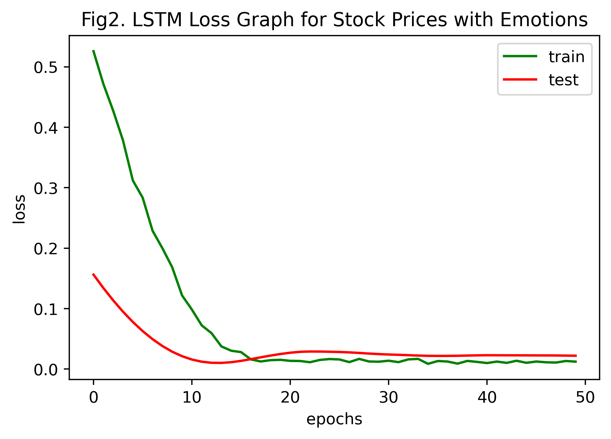
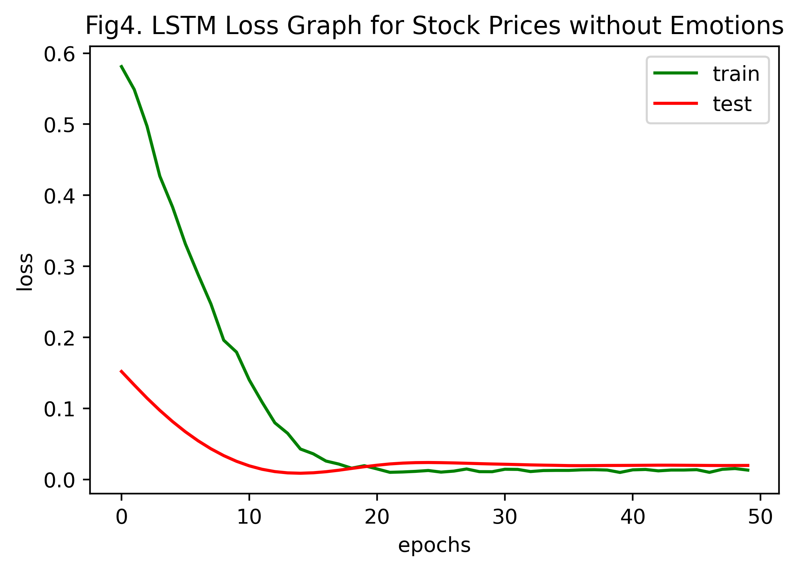
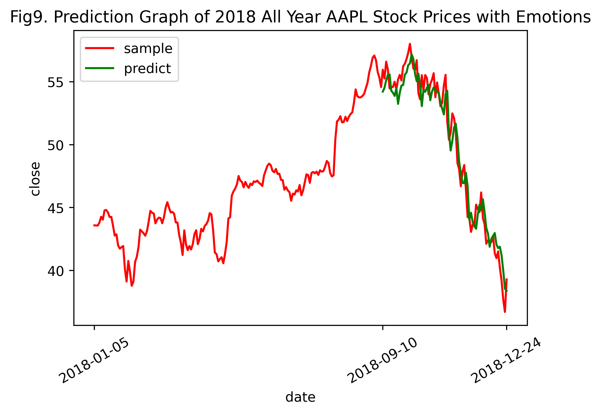

+++
title = "情感数据对LSTM股票预测模型的影响研究"
date = 2021-06-28T00:00:00+08:00
draft = false
slug = 'old-4'
+++

# 情感数据对LSTM股票预测模型的影响研究

**摘要**：探究了情感结构化特征数据在LSTM股票预测模型中的影响。利用Pandas对所给数据进行预处理（数据载入、清洗与准备、规整、时间序列处理、数据聚合等）。<a id="toref1" href="#ref1">[1]</a> 借助NLTK和LM金融词库，对非结构化文本信息进行情感分析，并将所得结构化数据融入纯技术指标的股票数据中。分析各股票指标的相关性，实现数据降维。基于Keras的以MSE为误差评价方法的LSTM模型，实现对股票收盘价Close的预测。最终得出当训练样本充足时，融入了情感特征数据，使得预测精度适当增加的结论。

> **实验说明**：
>
> **设计一个预测股票价格的方法，并用实例证明此方法的有效性**。
>
> 所给的数据，要求全部都要使用，注意数据需清洗、特征综合使用，可自己额外补充资源或数据。
>
> **提供的数据说明**：
>
> 1. 全标题  
>
>    a)    这是股票平台上发布的对各公司的分析文章
>
>    b)   标题：文章的标题
>
>    c)    字段1_链接_链接：原文章所在的URL
>
>    d)   ABOUT：文章针对的公司，都为缩写形式，多个公司以逗号隔开
>
>    e)    TIME：文章发布的时间
>
>    f)    AUTHOR：作者
>
>    g)    COMMENTS：采集时，文章的被评论次数
>
> 2. 摘要
>
>    a)    这是股票平台上发布的对各公司的分析文章的摘要部分，和“全标题”中的内容对应
>
>    b)   标题：文章的标题
>
>    c)    字段2：文章发布的时间
>
>    d)   字段5：文章针对的公司及提及的公司；
>
>    ​          i.      About为针对公司，都提取缩写的大写模型，多个公司以逗号隔开
>
>    ​         ii.      include为提及的其它公司，都提取缩写的大写模型，多个公司以逗号隔开
>
>    e)    字段1：摘要的全文字内容
>
> 3. 回帖
>
>    a)    这是网友在各文章下的回复内容 
>
>    b)   Title：各文章的标题；空标题的，用最靠近的有内容的下方标题
>
>    c)    Content：回复的全文字内容
>
> 4. 论坛
>
>    a)    这是网友在各公司的论坛页面下，对之进行评论的发帖内容 
>
>    b)   字段1：作者
>
>    c)    字段2：发帖日期
>
>    d)   字段3：帖子内容
>
>    e)    字段4_链接：具体的各公司的页面URL
>
> 5. 股票价格
>
>    a)    为各公司工作日股票的价格
>
>    b)   PERMNO：公司编号
>
>    c)    Date：日期
>
>    d)   TICKER：公司简写
>
>    e)    COMNAM：公司全写
>
>    f)    BIDLO：最低价
>
>    g)    ASKHI：最高价
>
>    h)   PRC： 收盘价
>
>    i)    VOL：成交量
>
>    j)    OPENPRC： 开盘价


[TOC]


**核心思想**：使用LSTM模型解决股票数据的时间序列预测问题和使用NLTK库对文本情感进行分析。

**根本观点**：历史会不断重演。本次作业均基于如下假设，股票规律并不是完全随机的，而是受人类心理学中某些规律的制约，在面对相似的情境时，会根据以往的经验和规律作出相似的反应。因此，可以根据历史资料的数据来预测未来股票的波动趋势。在股票的技术指标中，收盘价是一天结束时的价格，又是第二天的开盘价，联系前后两天，因此最为重要。<a id="toref2" href="#ref2">[2]</a>

**影响因素**：影响股票价格的因素除了基本的股票技术指标外，股票价格还和股民的情绪和相关股票分析文章的情感密切相关。

**分析方法**：将股票的技术指标和股民大众的情感评价相结合<a id="toref3" href="#ref3">[3]</a>，选择AAPL个股，对股票价格，即`收盘价`进行预测。分别对只含有技术指标和含有技术指标和情感评价的样本进行LSTM建模，使用`MSE`（均方误差）作为损失函数，对二者预测结果进行评价。

## 1 LSTM

### 1.1 LSTM是什么？

`LSTM Networks`（Long Short-Term Memory）*\- Hochreiter 1997*，长短期记忆神经网络，是一种特殊的RNN，能够学习长的依赖关系，记住较长的历史信息。

### 1.2 为什么决定使用LSTM？

Deep Neural Networks (DNN)，深度神经网络，有若干输入和一个输出，在输出和输入间学习得到一个线性关系，接着通过一个神经元激活函数得到结果1或-1. 但DNN不能较好地处理时间序列数据。Recurrent Neural Networks (RNN)，循环神经网络，可以更好地处理序列信息，但其缺点是不能记忆较长时期的时间序列，而且 Standard RNN Shortcomings 难以训练，给定初值条件下，收敛难度大。

LSTM解决了RNN的缺陷。LSTM相较于RNN模型增加了Forget Gate Layer（遗忘门），可以对上一个节点传进的输入进行选择性忘记。接着，选择需要记忆的重要输入信息。也就是“忘记不重要的，记住重要的”。这样，就**解决了RNN在长序列训练过程中的梯度消失和梯度爆炸问题，在长序列训练中有更佳的表现**。因此，我选用LSTM作为股票时间序列数据的训练模型。

## 2 深度学习名词概念解释

| Wrods     | Definitions                                                  |
| --------- | ------------------------------------------------------------ |
| Epoch     | 使用训练集的全部数据对模型进行一次完整的训练，被称之为“**一代训练**”。包括一次正向传播和一次反向传播 |
| Batch     | 使用训练集中的一小部分样本对模型权重进行一次反向传播的参数更新，这一小部分样本被称为“**一批数据**” |
| Iteration | 使用一个**Batch**数据对模型进行一次参数更新的过程，被称之为“**一次迭代** |

[Source1] https://www.jianshu.com/p/22c50ded4cf7?from=groupmessage

### 2.1 为什么要使用多于一个epoch？

只传递一次完整数据集是不够的，需要在神经网络中传递多次。随着`epoch`数量的增加，神经网络中的权重更新次数也在增加，这就导致了拟合曲线从欠拟合变为过拟合。

每次epoch之后，需要对总样本shuffle，再进入下一轮训练。（本次实验不用shuffle）

对不同数据集，epoch个数不同。

### 2.2 Batch 和 Batch_Size

目前绝大部分深度学习框架使用`Mini-batch Gradient Decent` 小批梯度下降，把数据分为若干批（`Batch`），每批有`Batch_Size`个数据，按批更新权重，一个Batch中的一组数据共同决定本次梯度的下降方向。
$$
Number of Batches = \frac{Training Set Size}{Batch Size}
$$

> 小批梯度下降克服了在数据量较大的情况下时，Batch Gradient Decent 的计算开销大、速度慢 和 Stochastic Gradient Decent 的随机性、收敛效果不佳的缺点。

[Source2] https://blog.csdn.net/dancing_power/article/details/97015723 

### 2.3 Iterations

一次iteration进行一次前向传播和反向传播。前向传播，基于属性X，得到预测结果y。反向传播根据给定的损失函数，求解参数（权重）。
$$
Numbers of Iterations = Number of Batched
$$

### 2.4 为什么不要shuffle？

避免数据投入的顺序对网络训练造成影响，增加训练的随机性，提高网络的泛化性能。

**但是针对本次股票价格的预测，使用LSTM模型，考虑时间因素，因此，需要设置`shuffle=False`，按时序顺序依次使用Batch更新参数。**

## 3 实验过程

以下实验均基于对`Apple, Inc.`（AAPL）苹果公司的股票进行预测分析。

`CORPORATIONABBR = 'AAPL'`

### 3.1 库导入

```python
# 数据分析的核心库
import numpy as np
import pandas as pd
from matplotlib import pyplot as plt
# 时间序列处理
from datetime import datetime
from dateutil.parser import parse as dt_parse
# 正则库
import re
# os库
from os import listdir
# NLTK自然语言处理库
import nltk
from nltk.corpus import stopwords
# seaborn成对图矩阵生成
from seaborn import pairplot
# sklearn库的归一化、训练集测试集划分
from sklearn.preprocessing import MinMaxScaler
from sklearn.model_selection import train_test_split
# Keras LSTM
from tensorflow.keras.models import Sequential
from tensorflow.keras.layers import LSTM, Dense, Dropout
# sklearn MSE
from sklearn.metrics import mean_squared_error
```

### 3.2 pandas核心设置

```python
# 设置pandas的最大显示行数、列数和输出宽度
pd.set_option('display.max_rows', 6)
pd.set_option('display.max_columns', 999)
pd.set_option('display.max_colwidth', 50)
```

### 3.3 数据载入、数据清洗与准备、数据规整、时间序列处理

#### 3.3.1 股票价格.csv

```python
sharePrices = pd.read_csv('股票价格.csv')
sharePrices
```

<div>
<style scoped>
    .dataframe tbody tr th:only-of-type {
        vertical-align: middle;
    }

    .dataframe tbody tr th {
        vertical-align: top;
    }
    
    .dataframe thead th {
        text-align: right;
    }
</style>
<table border="1" class="dataframe">
  <thead>
    <tr style="text-align: right;">
      <th></th>
      <th>PERMNO</th>
      <th>date</th>
      <th>TICKER</th>
      <th>COMNAM</th>
      <th>BIDLO</th>
      <th>ASKHI</th>
      <th>PRC</th>
      <th>VOL</th>
      <th>OPENPRC</th>
    </tr>
  </thead>
  <tbody>
    <tr>
      <th>0</th>
      <td>10026</td>
      <td>20180702</td>
      <td>JJSF</td>
      <td>J &amp; J SNACK FOODS CORP</td>
      <td>150.70000</td>
      <td>153.27499</td>
      <td>152.92000</td>
      <td>100388.0</td>
      <td>152.17999</td>
    </tr>
    <tr>
      <th>1</th>
      <td>10026</td>
      <td>20180703</td>
      <td>JJSF</td>
      <td>J &amp; J SNACK FOODS CORP</td>
      <td>151.35001</td>
      <td>153.73000</td>
      <td>153.32001</td>
      <td>55547.0</td>
      <td>153.67000</td>
    </tr>
    <tr>
      <th>2</th>
      <td>10026</td>
      <td>20180705</td>
      <td>JJSF</td>
      <td>J &amp; J SNACK FOODS CORP</td>
      <td>152.46001</td>
      <td>156.00000</td>
      <td>155.81000</td>
      <td>199370.0</td>
      <td>153.95000</td>
    </tr>
    <tr>
      <th>...</th>
      <td>...</td>
      <td>...</td>
      <td>...</td>
      <td>...</td>
      <td>...</td>
      <td>...</td>
      <td>...</td>
      <td>...</td>
      <td>...</td>
    </tr>
    <tr>
      <th>941515</th>
      <td>93436</td>
      <td>20181227</td>
      <td>TSLA</td>
      <td>TESLA INC</td>
      <td>301.50000</td>
      <td>322.17169</td>
      <td>316.13000</td>
      <td>8575133.0</td>
      <td>319.84000</td>
    </tr>
    <tr>
      <th>941516</th>
      <td>93436</td>
      <td>20181228</td>
      <td>TSLA</td>
      <td>TESLA INC</td>
      <td>318.41000</td>
      <td>336.23999</td>
      <td>333.87000</td>
      <td>9938992.0</td>
      <td>323.10001</td>
    </tr>
    <tr>
      <th>941517</th>
      <td>93436</td>
      <td>20181231</td>
      <td>TSLA</td>
      <td>TESLA INC</td>
      <td>325.26001</td>
      <td>339.20999</td>
      <td>332.79999</td>
      <td>6302338.0</td>
      <td>337.79001</td>
    </tr>
  </tbody>
</table>
<p>941518 rows × 9 columns</p>
</div>

**索引过滤**：索引过滤出TICKER（公司简写）为AAPL的数据行。

```python
sharePricesAAPL = sharePrices[sharePrices['TICKER']==CORPORATIONABBR]
```

**DataFrame降维**：不需要PERMNO（公司编号）、COMNAM（公司全写）、TICKER（公司简写）这三列数据，删除列。

```python
sharePricesAAPL.drop(['PERMNO', 'COMNAM', 'TICKER'], axis=1, inplace=True)
```

**索引数据类型检测**：确保相应索引的数据类型为float。

```python
sharePricesAAPL.info()
```

    <class 'pandas.core.frame.DataFrame'>
    Int64Index: 126 entries, 163028 to 163153
    Data columns (total 6 columns):
     #   Column   Non-Null Count  Dtype  
    ---  ------   --------------  -----  
     0   date     126 non-null    int64  
     1   BIDLO    126 non-null    float64
     2   ASKHI    126 non-null    float64
     3   PRC      126 non-null    float64
     4   VOL      126 non-null    float64
     5   OPENPRC  126 non-null    float64
    dtypes: float64(5), int64(1)
    memory usage: 6.9 KB

**索引检查**：检查date索引是否存在重复。

```python
sharePricesAAPL['date'].is_unique
```

    True

**时间序列**：将date（日期）转化为时间序列索引，并按此时间序列以升序排序。

```python
# date列转化为datetime类
sharePricesAAPL['date'] = sharePricesAAPL['date'].apply(lambda dt: datetime.strptime(str(dt), '%Y%m%d'))
# 设date列为索引
sharePricesAAPL.set_index('date', inplace=True)
# 按date升序排列
sharePricesAAPL.sort_values(by='date', inplace=True, ascending=True)
```

<div>
<style scoped>
    .dataframe tbody tr th:only-of-type {
        vertical-align: middle;
    }

    .dataframe tbody tr th {
        vertical-align: top;
    }
    
    .dataframe thead th {
        text-align: right;
    }
</style>
<table border="1" class="dataframe">
  <thead>
    <tr style="text-align: right;">
      <th></th>
      <th>BIDLO</th>
      <th>ASKHI</th>
      <th>PRC</th>
      <th>VOL</th>
      <th>OPENPRC</th>
    </tr>
    <tr>
      <th>date</th>
      <th></th>
      <th></th>
      <th></th>
      <th></th>
      <th></th>
    </tr>
  </thead>
  <tbody>
    <tr>
      <th>2018-07-02</th>
      <td>183.42000</td>
      <td>187.30</td>
      <td>187.17999</td>
      <td>17612113.0</td>
      <td>183.82001</td>
    </tr>
    <tr>
      <th>2018-07-03</th>
      <td>183.53999</td>
      <td>187.95</td>
      <td>183.92000</td>
      <td>13909764.0</td>
      <td>187.78999</td>
    </tr>
    <tr>
      <th>2018-07-05</th>
      <td>184.28000</td>
      <td>186.41</td>
      <td>185.39999</td>
      <td>16592763.0</td>
      <td>185.25999</td>
    </tr>
    <tr>
      <th>...</th>
      <td>...</td>
      <td>...</td>
      <td>...</td>
      <td>...</td>
      <td>...</td>
    </tr>
    <tr>
      <th>2018-12-27</th>
      <td>150.07001</td>
      <td>156.77</td>
      <td>156.14999</td>
      <td>53117005.0</td>
      <td>155.84000</td>
    </tr>
    <tr>
      <th>2018-12-28</th>
      <td>154.55000</td>
      <td>158.52</td>
      <td>156.23000</td>
      <td>42291347.0</td>
      <td>157.50000</td>
    </tr>
    <tr>
      <th>2018-12-31</th>
      <td>156.48000</td>
      <td>159.36</td>
      <td>157.74001</td>
      <td>35003466.0</td>
      <td>158.53000</td>
    </tr>
  </tbody>
</table>
<p>126 rows × 5 columns</p>
</div>

**缺失值处理**：检查AAPL股票技术指标数据每列缺失比，发现无缺失。若有，则可对BIDLO（最低价）、ASKHI（最高价）、PRC收盘价、VOL（成交量）有缺失的数据行直接删除。对OPENPRC（开盘价）有缺失的使用*拉格朗日插值法*进行填充。

> 其实之后对`股票价格.csv`分析可知，缺失项的分布都在同一行，故只要使用`df.dropna()`删除存在任意数目缺失项的行即可。

```python
sharePricesAAPL.isnull().mean()
```

    BIDLO      0.0
    ASKHI      0.0
    PRC        0.0
    VOL        0.0
    OPENPRC    0.0
    dtype: float64

**重建索引**：重命名索引，方便后期使用，映射为BIDLO-low、ASKHI-high、PRC-close、VOL-vol、OPENPRC-open。改变索引顺序为open、high、low、vol、close。

```python
# rename
AAPL_newIndex = {'BIDLO': 'low',
                 'ASKHI': 'high',
                 'PRC': 'close',
                 'VOL': 'vol',
                 'OPENPRC': 'open'}
sharePricesAAPL.rename(columns=AAPL_newIndex, inplace=True)
# reindex
AAPL_newColOrder = ['open', 'high', 'low', 'vol', 'close']
sharePricesAAPL = sharePricesAAPL.reindex(columns=AAPL_newColOrder)
```

**检测过滤异常值**：无异常。

```python
sharePricesAAPL.describe()
```

<div>
<style scoped>
    .dataframe tbody tr th:only-of-type {
        vertical-align: middle;
    }

    .dataframe tbody tr th {
        vertical-align: top;
    }
    
    .dataframe thead th {
        text-align: right;
    }
</style>
<table border="1" class="dataframe">
  <thead>
    <tr style="text-align: right;">
      <th></th>
      <th>open</th>
      <th>high</th>
      <th>low</th>
      <th>vol</th>
      <th>close</th>
    </tr>
  </thead>
  <tbody>
    <tr>
      <th>count</th>
      <td>126.000000</td>
      <td>126.000000</td>
      <td>126.000000</td>
      <td>1.260000e+02</td>
      <td>126.000000</td>
    </tr>
    <tr>
      <th>mean</th>
      <td>201.247420</td>
      <td>203.380885</td>
      <td>198.893344</td>
      <td>3.510172e+07</td>
      <td>201.106033</td>
    </tr>
    <tr>
      <th>std</th>
      <td>21.368524</td>
      <td>21.499932</td>
      <td>21.596966</td>
      <td>1.577876e+07</td>
      <td>21.663971</td>
    </tr>
    <tr>
      <th>...</th>
      <td>...</td>
      <td>...</td>
      <td>...</td>
      <td>...</td>
      <td>...</td>
    </tr>
    <tr>
      <th>50%</th>
      <td>207.320000</td>
      <td>209.375000</td>
      <td>205.785150</td>
      <td>3.234006e+07</td>
      <td>207.760005</td>
    </tr>
    <tr>
      <th>75%</th>
      <td>219.155000</td>
      <td>222.172503</td>
      <td>216.798175</td>
      <td>4.188390e+07</td>
      <td>219.602500</td>
    </tr>
    <tr>
      <th>max</th>
      <td>230.780000</td>
      <td>233.470000</td>
      <td>229.780000</td>
      <td>9.624355e+07</td>
      <td>232.070010</td>
    </tr>
  </tbody>
</table>
<p>8 rows × 5 columns</p>
</div>

**数据存储**：存储处理好的数据为`AAPL股票价格.csv`，存至`补充数据1925102007`文件夹。方便后续读取使用。

```python
sharePricesAAPL.to_csv('补充数据1925102007/AAPL股票价格.csv')
```

#### 3.3.2 论坛.csv

<div>
<style scoped>
    .dataframe tbody tr th:only-of-type {
        vertical-align: middle;
    }

    .dataframe tbody tr th {
        vertical-align: top;
    }
    
    .dataframe thead th {
        text-align: right;
    }
</style>
<table border="1" class="dataframe">
  <thead>
    <tr style="text-align: right;">
      <th></th>
      <th>字段1</th>
      <th>字段2</th>
      <th>字段3</th>
      <th>字段4_链接</th>
    </tr>
  </thead>
  <tbody>
    <tr>
      <th>0</th>
      <td>ComputerBlue</td>
      <td>31-Dec-18</td>
      <td>Let's create a small spec POS portfolio $COTY ...</td>
      <td>https://seekingalpha.com/symbol/COTY</td>
    </tr>
    <tr>
      <th>1</th>
      <td>Darren McCammon</td>
      <td>31-Dec-18</td>
      <td>$RICK "Now that we've reported results, we'll ...</td>
      <td>https://seekingalpha.com/symbol/RICK</td>
    </tr>
    <tr>
      <th>2</th>
      <td>Jonathan Cooper</td>
      <td>31-Dec-18</td>
      <td>Do any $APHA shareholders support the $GGB tak...</td>
      <td>https://seekingalpha.com/symbol/APHA</td>
    </tr>
    <tr>
      <th>...</th>
      <td>...</td>
      <td>...</td>
      <td>...</td>
      <td>...</td>
    </tr>
    <tr>
      <th>25114</th>
      <td>Power Hedge</td>
      <td>1-Jan-18</td>
      <td>USD Expected to Collapse in 2018 https://goo.g...</td>
      <td>https://goo.gl/RG1CDd</td>
    </tr>
    <tr>
      <th>25115</th>
      <td>Norman Tweed</td>
      <td>1-Jan-18</td>
      <td>Happy New Year everyone! I'm adding to $MORL @...</td>
      <td>https://seekingalpha.com/symbol/MORL</td>
    </tr>
    <tr>
      <th>25116</th>
      <td>User 40986305</td>
      <td>1-Jan-18</td>
      <td>Jamie Diamond says Trump is most pro business ...</td>
      <td>NaN</td>
    </tr>
  </tbody>
</table>
<p>25117 rows × 4 columns</p>
</div>

**缺失值处理**：删除字段4（各公司页面的URL）缺失的数据行。

```python
forum = pd.read_csv('论坛.csv')
forum.dropna(inplace=True)
```

**字符串操作和正则**：观察字段4（URL），`seekingalpha.com/symbol/`网址后的内容为公司简称，使用pandas字符串操作和正则对公司简称进行提取，提取失败则删除该数据行。将字段4的数据内容替换为公司简称。

```python
forum_regExp = re.compile(r'seekingalpha\.com/symbol/([A-Z]+)')
def forumAbbr(link):
    # 成功查找公司简称则返回简称，否则以缺失值填补
    res = forum_regExp.search(link)
    return np.NAN if res is None else res.group(1)
forum['字段4_链接'] = forum['字段4_链接'].apply(forumAbbr)
```

**索引过滤**：提取所有公司简称为AAPL的评论。

**降维处理**：字段1（作者名称）无用，可以删除。

**索引重构**：重命名索引，字段3（帖子内容）-remark。

**时间序列**：将字段2转化为时间序列索引，命名为date，并按此索引升序排列。

```python
# 索引过滤
forum = forum[forum['字段4_链接']==CORPORATIONABBR]
# 降维处理
forum.drop(['字段1', '字段4_链接'], axis=1, inplace=True)
# 索引重构
AAPL_newIndex_forum = {'字段2': 'date', '字段3': 'remark'}
forum.rename(columns=AAPL_newIndex_forum, inplace=True)
# 时间序列
forum['date'] = forum['date'].apply(lambda dt: datetime.strptime(str(dt), '%d-%b-%y'))
```

**正则过滤评论网址**：观察评论不难发现，部分评论内有网址，使用正则表达式过滤之，防止对后续情感分析产生影响。

```python
forum_regExp_linkFilter = re.compile(r'(http|https):\/\/[\w\-_]+(\.[\w\-_]+)+([\w\-\.,@?^=%&:/~\+#]*[\w\-\@?^=%&/~\+#])?')
forum['remark'] = forum['remark'].apply(lambda x: forum_regExp_linkFilter.sub('', x))
forum
```

<div>
<style scoped>
    .dataframe tbody tr th:only-of-type {
        vertical-align: middle;
    }

    .dataframe tbody tr th {
        vertical-align: top;
    }
    
    .dataframe thead th {
        text-align: right;
    }
</style>
<table border="1" class="dataframe">
  <thead>
    <tr style="text-align: right;">
      <th></th>
      <th>date</th>
      <th>remark</th>
    </tr>
  </thead>
  <tbody>
    <tr>
      <th>204</th>
      <td>2018-12-26</td>
      <td>Many Chinese companies are encouraging their e...</td>
    </tr>
    <tr>
      <th>418</th>
      <td>2018-12-21</td>
      <td>This Week in Germany 🇩🇪 | Apple Smashed 📱 $AAP...</td>
    </tr>
    <tr>
      <th>471</th>
      <td>2018-12-21</td>
      <td>$AAPL gets hit with another partial ban in Ger...</td>
    </tr>
    <tr>
      <th>...</th>
      <td>...</td>
      <td>...</td>
    </tr>
    <tr>
      <th>24702</th>
      <td>2018-01-05</td>
      <td>$AAPL. Claims by GHH is 200 billion repatriati...</td>
    </tr>
    <tr>
      <th>24902</th>
      <td>2018-01-03</td>
      <td>$AAPL Barclays says battery replacement could ...</td>
    </tr>
    <tr>
      <th>25083</th>
      <td>2018-01-02</td>
      <td>2018 will be the year for $AAPL to hit the 1 t...</td>
    </tr>
  </tbody>
</table>
<p>330 rows × 2 columns</p>
</div>

> 同时，在进行情感分析时，应增加停用词`AAPL`.

**数据存储**：存储为`补充数据1925102007/AAPL论坛.csv`。

```python
# 数据储存
forum.to_csv('补充数据1925102007/AAPL论坛.csv', index=False)
```

#### 3.3.3 全标题.xlsx

<div>
<style scoped>
    .dataframe tbody tr th:only-of-type {
        vertical-align: middle;
    }

    .dataframe tbody tr th {
        vertical-align: top;
    }
    
    .dataframe thead th {
        text-align: right;
    }
</style>
<table border="1" class="dataframe">
  <thead>
    <tr style="text-align: right;">
      <th></th>
      <th>标题</th>
      <th>字段1_链接_链接</th>
      <th>ABOUT</th>
      <th>TIME</th>
      <th>AUTHOR</th>
      <th>COMMENTS</th>
      <th>Unnamed: 6</th>
    </tr>
  </thead>
  <tbody>
    <tr>
      <th>0</th>
      <td>Micron Technology: Insanely Cheap Stock Given ...</td>
      <td>https://seekingalpha.com/article/4230920-micro...</td>
      <td>MU</td>
      <td>Dec. 31, 2018, 7:57 PM</td>
      <td>Ruerd Heeg</td>
      <td>75 Comments</td>
      <td>NaN</td>
    </tr>
    <tr>
      <th>1</th>
      <td>Molson Coors Seems Attractive At These Valuations</td>
      <td>https://seekingalpha.com/article/4230922-molso...</td>
      <td>TAP</td>
      <td>Dec. 31, 2018, 7:44 PM</td>
      <td>Sanjit Deepalam</td>
      <td>16 Comments</td>
      <td>NaN</td>
    </tr>
    <tr>
      <th>2</th>
      <td>Gerdau: The Brazilian Play On U.S. Steel</td>
      <td>https://seekingalpha.com/article/4230917-gerda...</td>
      <td>GGB</td>
      <td>Dec. 31, 2018, 7:10 PM</td>
      <td>Shannon Bruce</td>
      <td>1 Comment</td>
      <td>NaN</td>
    </tr>
    <tr>
      <th>...</th>
      <td>...</td>
      <td>...</td>
      <td>...</td>
      <td>...</td>
      <td>...</td>
      <td>...</td>
      <td>...</td>
    </tr>
    <tr>
      <th>17925</th>
      <td>Big Changes For Centurylink, AT&amp;T And Verizon ...</td>
      <td>https://seekingalpha.com/article/4134687-big-c...</td>
      <td>CTL, T, VZ</td>
      <td>Jan. 1, 2018, 5:38 AM</td>
      <td>EconDad</td>
      <td>32 Comments</td>
      <td>NaN</td>
    </tr>
    <tr>
      <th>17926</th>
      <td>UPS: If The Founders Were Alive Today</td>
      <td>https://seekingalpha.com/article/4134684-ups-f...</td>
      <td>UPS</td>
      <td>Jan. 1, 2018, 5:11 AM</td>
      <td>Roger Gaebel</td>
      <td>15 Comments</td>
      <td>NaN</td>
    </tr>
    <tr>
      <th>17927</th>
      <td>U.S. Silica - Buying The Dip Of This Booming C...</td>
      <td>https://seekingalpha.com/article/4134664-u-s-s...</td>
      <td>SLCA</td>
      <td>Jan. 1, 2018, 12:20 AM</td>
      <td>The Value Investor</td>
      <td>27 Comments</td>
      <td>NaN</td>
    </tr>
  </tbody>
</table>
<p>17928 rows × 7 columns</p>
</div>

**索引过滤**：提取所有`ABOUT`为AAPL的标题数据行。

**降维处理**：字段1\_链接\_链接、ABOUT、AUTHOR、COMMENTS、Unnamed: 6列删除。

**索引重构**：重命名索引，标题-title、ABOUT-abbr、TIME-date。

**时间序列**：将date转化为时间序列索引，并按此索引升序排列。

**数据存储**：存储为`补充数据1925102007/AAPL全标题.csv`。

```python
allTitles = pd.read_excel('全标题.xlsx')
# 索引过滤
allTitles = allTitles[allTitles['ABOUT']==CORPORATIONABBR]
# 降维
allTitles.drop(['字段1_链接_链接',
                'ABOUT',
                'AUTHOR',
                'COMMENTS',
                'Unnamed: 6'], axis=1, inplace=True)
# 索引重构
AAPL_newIndex_allTitles = {'标题': 'title', 'TIME': 'date'}
allTitles.rename(columns=AAPL_newIndex_allTitles, inplace=True)
# 时间序列处理
# 因时间日期格式非统一，故选用dateutil包对parser.parse方法识别多变时间格式
allTitles['date'] = allTitles['date'].apply(lambda dt: dt_parse(dt))
# 设date列为索引
allTitles.set_index('date', inplace=True)
# 按date升序排列
allTitles.sort_values(by='date', inplace=True, ascending=True)
# 数据储存
allTitles.to_csv('补充数据1925102007/AAPL全标题.csv')
allTitles
```

<div>
<style scoped>
    .dataframe tbody tr th:only-of-type {
        vertical-align: middle;
    }

    .dataframe tbody tr th {
        vertical-align: top;
    }
    
    .dataframe thead th {
        text-align: right;
    }
</style>
<table border="1" class="dataframe">
  <thead>
    <tr style="text-align: right;">
      <th></th>
      <th>title</th>
    </tr>
    <tr>
      <th>date</th>
      <th></th>
    </tr>
  </thead>
  <tbody>
    <tr>
      <th>2018-01-04 10:12:00</th>
      <td>Apple Ia Above A 'Golden Cross' And Has A Posi...</td>
    </tr>
    <tr>
      <th>2018-01-08 10:59:00</th>
      <td>Apple Cash: What Would Warren Buffett Say?</td>
    </tr>
    <tr>
      <th>2018-01-16 06:34:00</th>
      <td>Apple's iPhone Battery Replacement Could Consu...</td>
    </tr>
    <tr>
      <th>...</th>
      <td>...</td>
    </tr>
    <tr>
      <th>2018-12-31 08:52:00</th>
      <td>Will Apple Beat Its Guidance?</td>
    </tr>
    <tr>
      <th>2018-12-31 17:12:00</th>
      <td>How Much Stock Could Apple Have Repurchased In...</td>
    </tr>
    <tr>
      <th>2018-12-31 17:36:00</th>
      <td>Will Apple Get Its Mojo Back?</td>
    </tr>
  </tbody>
</table>
<p>204 rows × 1 columns</p>
</div>

#### 3.3.4 摘要.xlsx

<div>
<style scoped>
    .dataframe tbody tr th:only-of-type {
        vertical-align: middle;
    }

    .dataframe tbody tr th {
        vertical-align: top;
    }
    
    .dataframe thead th {
        text-align: right;
    }
</style>
<table border="1" class="dataframe">
  <thead>
    <tr style="text-align: right;">
      <th></th>
      <th>标题</th>
      <th>字段2</th>
      <th>字段5</th>
      <th>字段1</th>
    </tr>
  </thead>
  <tbody>
    <tr>
      <th>0</th>
      <td>HealthEquity: Strong Growth May Be Slowing Hea...</td>
      <td>Apr.  1, 2019 10:46 PM ET</td>
      <td>| About: HealthEquity, Inc. (HQY)</td>
      <td>SummaryHealthEquity’s revenue and earnings hav...</td>
    </tr>
    <tr>
      <th>1</th>
      <td>Valero May Rally Up To 40% Within The Next 12 ...</td>
      <td>Apr.  1, 2019 10:38 PM ET</td>
      <td>| About: Valero Energy Corporation (VLO)</td>
      <td>SummaryValero is ideally positioned to benefit...</td>
    </tr>
    <tr>
      <th>2</th>
      <td>Apple Makes A China Move</td>
      <td>Apr.  1, 2019  7:21 PM ET</td>
      <td>| About: Apple Inc. (AAPL)</td>
      <td>SummaryCompany cuts prices on many key product...</td>
    </tr>
    <tr>
      <th>...</th>
      <td>...</td>
      <td>...</td>
      <td>...</td>
      <td>...</td>
    </tr>
    <tr>
      <th>10128</th>
      <td>Rubicon Technology: A Promising Net-Net Cash-B...</td>
      <td>Jul. 24, 2018  2:16 PM ET</td>
      <td>| About: Rubicon Technology, Inc. (RBCN)</td>
      <td>SummaryRubicon is trading well below likely li...</td>
    </tr>
    <tr>
      <th>10129</th>
      <td>Stamps.com: A Cash Machine</td>
      <td>Jul. 24, 2018  1:57 PM ET</td>
      <td>| About: Stamps.com Inc. (STMP)</td>
      <td>SummaryThe Momentum Growth Quotient for the co...</td>
    </tr>
    <tr>
      <th>10130</th>
      <td>Can Heineken Turn The 'Mallya Drama' In Its Ow...</td>
      <td>Jul. 24, 2018  1:24 PM ET</td>
      <td>| About: Heineken N.V. (HEINY), Includes: BUD,...</td>
      <td>SummaryMallya, United Breweries' chairman, can...</td>
    </tr>
  </tbody>
</table>
<p>10131 rows × 4 columns</p>
</div>

经检查，摘要.xlsx无缺失值，我们只需要标题和字段1（摘要的全文字内容），其余数据列删去。将索引映射为：标题-title、字段1-abstract. 

```python
abstracts = pd.read_excel('摘要.xlsx')
abstracts.drop(['字段2', '字段5'], axis=1, inplace=True)
newIndex_abstracts = {'标题': 'title', '字段1': 'abstract'}
abstracts.rename(columns=newIndex_abstracts, inplace=True)
```

**求交集**：和`AAPL全标题.csv`中title相对应的数据行是针对AAPL股票公司文章的摘要，只需要对AAPL文章的摘要即可。

```python
abstracts = abstracts.merge(allTitles, on=['title'], how='inner')
```

**保存**：存储为`补充数据1925102007/AAPL摘要.csv`。

```python
abstracts.to_csv('补充数据1925102007/AAPL摘要.csv', index=False)
abstracts
```

<div>
<style scoped>
    .dataframe tbody tr th:only-of-type {
        vertical-align: middle;
    }

    .dataframe tbody tr th {
        vertical-align: top;
    }
    
    .dataframe thead th {
        text-align: right;
    }
</style>
<table border="1" class="dataframe">
  <thead>
    <tr style="text-align: right;">
      <th></th>
      <th>title</th>
      <th>abstract</th>
    </tr>
  </thead>
  <tbody>
    <tr>
      <th>0</th>
      <td>Will Apple Get Its Mojo Back?</td>
      <td>SummaryApple has been resting on a reputation ...</td>
    </tr>
    <tr>
      <th>1</th>
      <td>How Much Stock Could Apple Have Repurchased In...</td>
      <td>SummaryApple's stock plummeted from $227.26 to...</td>
    </tr>
    <tr>
      <th>2</th>
      <td>Will Apple Beat Its Guidance?</td>
      <td>SummaryApple has sold fewer iPhones, which gen...</td>
    </tr>
    <tr>
      <th>...</th>
      <td>...</td>
      <td>...</td>
    </tr>
    <tr>
      <th>83</th>
      <td>Apple: Still The Ultimate Value Growth Stock T...</td>
      <td>SummaryApple reported superb earnings on Tuesd...</td>
    </tr>
    <tr>
      <th>84</th>
      <td>Apple In 2023</td>
      <td>SummaryWhere can the iPhone go from here?The A...</td>
    </tr>
    <tr>
      <th>85</th>
      <td>Apple's Real Value Today</td>
      <td>SummaryApple has reached new highs this week.W...</td>
    </tr>
  </tbody>
</table>
<p>86 rows × 2 columns</p>
</div>

#### 3.3.5 回帖

```python
pd.read_excel('回帖/SA_Comment_Page131-153.xlsx')
```

<div>
<style scoped>
    .dataframe tbody tr th:only-of-type {
        vertical-align: middle;
    }

    .dataframe tbody tr th {
        vertical-align: top;
    }
    
    .dataframe thead th {
        text-align: right;
    }
</style>
<table border="1" class="dataframe">
  <thead>
    <tr style="text-align: right;">
      <th></th>
      <th>字段</th>
      <th>标题1</th>
    </tr>
  </thead>
  <tbody>
    <tr>
      <th>0</th>
      <td>you should all switch to instagram</td>
      <td>NaN</td>
    </tr>
    <tr>
      <th>1</th>
      <td>Long Facebook and Instagram. They will recover...</td>
      <td>NaN</td>
    </tr>
    <tr>
      <th>2</th>
      <td>Personally, I think people will be buying FB a...</td>
      <td>NaN</td>
    </tr>
    <tr>
      <th>...</th>
      <td>...</td>
      <td>...</td>
    </tr>
    <tr>
      <th>19968</th>
      <td>Thank you for the article.If you really think ...</td>
      <td>Qiwi: The Current Sell-Off Was Too Emotional</td>
    </tr>
    <tr>
      <th>19969</th>
      <td>Isn't WRK much better investment than PKG? Thanks</td>
      <td>NaN</td>
    </tr>
    <tr>
      <th>19970</th>
      <td>GuruFocus is also showing a Priotroski score o...</td>
      <td>Packaging Corporation Of America: Target Retur...</td>
    </tr>
  </tbody>
</table>
<p>19971 rows × 2 columns</p>
</div>

```python
pd.read_csv('回帖/SA_Comment_Page181-255(1).csv')
```

<div>
<style scoped>
    .dataframe tbody tr th:only-of-type {
        vertical-align: middle;
    }

    .dataframe tbody tr th {
        vertical-align: top;
    }
    
    .dataframe thead th {
        text-align: right;
    }
</style>
<table border="1" class="dataframe">
  <thead>
    <tr style="text-align: right;">
      <th></th>
      <th>字段1</th>
      <th>标题</th>
    </tr>
  </thead>
  <tbody>
    <tr>
      <th>0</th>
      <td>I bought at $95 and holding strong. Glad I did...</td>
      <td>NaN</td>
    </tr>
    <tr>
      <th>1</th>
      <td>The price rally you are referring to is not be...</td>
      <td>Michael Kors: Potential For Further Upside Ahead</td>
    </tr>
    <tr>
      <th>2</th>
      <td>only a concern if you own it....</td>
      <td>NaN</td>
    </tr>
    <tr>
      <th>...</th>
      <td>...</td>
      <td>...</td>
    </tr>
    <tr>
      <th>19997</th>
      <td>What can Enron Musk do legally to boost  balan...</td>
      <td>NaN</td>
    </tr>
    <tr>
      <th>19998</th>
      <td>The last two weeks feels like a short squeeze....</td>
      <td>NaN</td>
    </tr>
    <tr>
      <th>19999</th>
      <td>" Tesla is no longer a growth or value proposi...</td>
      <td>NaN</td>
    </tr>
  </tbody>
</table>
<p>20000 rows × 2 columns</p>
</div>

索引重命名：字段1（回帖内容）-content、标题-title.（注意.csv和.xlsx不同）

缺失值处理：对于回帖中标题1（各文章标题）的定义空标题的，用最靠近的有内容的下方标题，故采取用下一个非缺失值填充前缺失值的方法`df.fillna(method='bfill')`。

数据文件读取：使用`os.listdir()`返回指定文件夹下包含的文件名列表，以.xlsx或.csv结尾的文件均为数据文件，读入后进行上述缺失值处理和索引重命名。

回帖过滤：遍历所有数据文件，找出所有title在`AAPL全标题.csv`中的回帖行数据，检查是否有缺失，存至`补充数据1925102007/AAPL回帖.csv`

```python
# 数据文件读取
repliesFiles = listdir('回帖')
allAALPReplies = []
newIndex_replies_csv = {'字段1': 'content', '标题': 'title'}
newIndex_replies_xlsx = {'字段': 'content', '标题1': 'title'}
# 遍历回帖目录下所有回帖数据找出和AAPL相关的回帖
for file in repliesFiles:
    path = '回帖/'+file
    if file.endswith('.csv'):
        replies = pd.read_csv(path)
        newIndex_replies = newIndex_replies_csv
    elif file.endswith('.xlsx'):
        replies = pd.read_excel(path)
        newIndex_replies = newIndex_replies_xlsx
    else:
        print('Wrong file format,', file)
        break
    # 索引重命名
    replies.rename(columns=newIndex_replies, inplace=True)
    # 缺失值填充
    replies.fillna(method='bfill', inplace=True)
    # 回帖过滤
    allAALPReplies.extend(replies.merge(allTitles, on=['title'], how='inner').values)
# 所有和AAPL文章标题所对应的回帖
allAALPReplies = pd.DataFrame(allAALPReplies, columns=['content', 'title'])
# 保存
allAALPReplies.to_csv('补充数据1925102007/AAPL回帖.csv', index=False)
# 展示
allAALPReplies
```

<div>
<style scoped>
    .dataframe tbody tr th:only-of-type {
        vertical-align: middle;
    }

    .dataframe tbody tr th {
        vertical-align: top;
    }
    
    .dataframe thead th {
        text-align: right;
    }
</style>
<table border="1" class="dataframe">
  <thead>
    <tr style="text-align: right;">
      <th></th>
      <th>content</th>
      <th>title</th>
    </tr>
  </thead>
  <tbody>
    <tr>
      <th>0</th>
      <td>Understood. But let me ask you. 64GB of pics i...</td>
      <td>iPhone XR And XS May Be Apple's Most Profitabl...</td>
    </tr>
    <tr>
      <th>1</th>
      <td>Just upgraded from 6 to XS, 256G. Love it. I'l...</td>
      <td>iPhone XR And XS May Be Apple's Most Profitabl...</td>
    </tr>
    <tr>
      <th>2</th>
      <td>Yup, AAPL will grow profits 20% per year despi...</td>
      <td>iPhone XR And XS May Be Apple's Most Profitabl...</td>
    </tr>
    <tr>
      <th>...</th>
      <td>...</td>
      <td>...</td>
    </tr>
    <tr>
      <th>4503</th>
      <td>With all due respect, never have paid for and ...</td>
      <td>Gain Exposure To Apple Through Berkshire Hathaway</td>
    </tr>
    <tr>
      <th>4504</th>
      <td>This one's easy - own both!</td>
      <td>Gain Exposure To Apple Through Berkshire Hathaway</td>
    </tr>
    <tr>
      <th>4505</th>
      <td>No Thanks! I like my divys,and splits too much...</td>
      <td>Gain Exposure To Apple Through Berkshire Hathaway</td>
    </tr>
  </tbody>
</table>
<p>4506 rows × 2 columns</p>
</div>

### 3.4 情感分析

> 使用第三方NLP库：**NLTK** (Natural Language Toolkit)
>
> NLTK is a leading platform for building Python programs to work with human language data. It provides easy-to-use interfaces such as WordNet, along with a suite of text processing libraries for classification, tokenization, stemming, tagging, parsing, and semantic reasoning, wrappers for industrial-strength NLP libraries. 
>
> **安装完nltk库以后，需要使用`nltk.download()`命令下载相应语料库。因为速度太慢，我选择直接装nltk_data数据包，核心数据包放在补充文件夹内。**
>
> **为提高情感分析效率和精度，停用词还需增加`['!', ',' ,'.' ,'?' ,'-s' ,'-ly' ,'</s> ', 's', 'AAPL', 'apple', '$', '%']`. 使用`stopwords.add()`添加停用词。**
>
> [Source3] http://www.nltk.org

> 金融情感词库：**LM** (LoughranMcDonald) sentiment word lists 2018
>
> [Loughran-McDonald Sentiment Word Lists](https://sraf.nd.edu/textual-analysis/resources/#LM Sentiment Word Lists) is an Excel file containing each of the LM sentiment words by category (Negative, Positive, Uncertainty, Litigious, Strong Modal, Weak Modal, Constraining).
>
> 词库路径：`/补充数据1925102007/LoughranMcDonald_SentimentWordLists_2018.xlsx`
>
> [Source4] https://sraf.nd.edu/textual-analysis/resources

#### 3.4.1 情感分析思路

* **分词处理**：使用NLTK对文本（这里指评论数据）进行分词处理（tokenize）
* **停用词处理**：去除停用词（stopwords）
* **结构化**：利用LM金融情感词库中的Positive和Negative表单词库，计算`pos`和`neg`值作为非结构化文本数据的结构化特征。（*即以评论中posWords和negWords的占比作为文本数据的特征*）
* **数据聚合**：对上述数据进行聚合操作，并按工作日（股票的交易时间是`Business Day`）为单位进行重采样

$$
pos = \frac{Num of PosWrods}{Total Words}
$$

$$
neg = \frac{Num of NegWrods}{Total Words}
$$

#### 3.4.2 词库导入和添加停用词

```python
# 词库导入
wordListsPath = '补充数据1925102007/LoughranMcDonald_SentimentWordLists_2018.xlsx'
posWords = pd.read_excel(wordListsPath, header=None, sheet_name='Positive').iloc[:,0].values
negWords = pd.read_excel(wordListsPath, header=None, sheet_name='Negative').iloc[:,0].values

# 添加停用词
extraStopwords = ['!', ',' ,'.' ,'?' ,'-s' ,'-ly' ,'</s> ', 's', 'AAPL', 'apple', '$', '%']
stopWs = stopwords.words('english') + extraStopwords
```

#### 3.4.3 函数定义

```python
def structComment(sentence, posW, negW, stopW):
    """
    结构化句子
    :param sentence: 待结构化的评论
    :param posW: 正词性
    :param negW: 负词性
    :param stopW: 停用词
    :return: 去除停用词后的评论中posWords和negWords的占比(pos, neg)
    """
    # 分词
    tokenizer = nltk.word_tokenize(sentence)
    # 停用词过滤
    tokenizer = [w.upper() for w in tokenizer if w.lower() not in stopW]
    # 正词提取
    posWs = [w for w in tokenizer if w in posW]
    # 负词提取
    negWs = [w for w in tokenizer if w in negW]
    # tokenizer长度
    len_token = len(tokenizer)
    # 句子长度为0，即分母为0时
    if len_token<=0:
        return 0, 0
    else:
        return len(posWs)/len_token, len(negWs)/len_token
```

```python
def NLProcessing(fileName, colName):
    """
    自然语言处理方法：将传入的fileName(.csv)对应的数据中的colName列文本数据结构化，并保存
    :param fileName: 文件名，在文件夹 补充数据1925102007/ 下查找对应文件
    :param colName: 需要结构化的文本数据列
    :return: 新增pos和neg列的DataFrame
    """
    pathNLP = '补充数据1925102007/'+fileName+'.csv'
    data = pd.read_csv(pathNLP)
    # pos和neg结构化数据列构造
    posAndneg = [ structComment(st, posWords, negWords, stopWs) for st in data[colName].values]
    # 构造posAndneg的DataFrame
    posAndneg = pd.DataFrame(posAndneg, columns=['pos', 'neg'])
    # 轴向连接
    data = pd.concat([data, posAndneg], axis=1)
    # 删除文本数据列
    data.drop([colName], axis=1, inplace=True)
    # 保存结构化的数据
    data.to_csv(pathNLP)
    return data
```

#### 3.4.4 情感分析处理

```python
# AAPL论坛.csv
forum = NLProcessing('AAPL论坛', 'remark')
# AAPL摘要.csv
abstracts = NLProcessing('AAPL摘要', 'abstract')
# AAPL回帖.csv
allAALPReplies = NLProcessing('AAPL回帖', 'content')
```

#### 3.4.5 情感特征数据聚合

上述操作得到带有title列的结构化数据（AAPL回帖.csv和AAPL摘要.csv）后，先将回帖和摘要用concat函数沿纵轴连接，再以title为索引，与AAPL全标题.csv（allTitles）进行外联合并（Outer Merge），删除无用的title列。forum结构化数据和上一步所得数据进行concat轴相连接（沿纵轴）。最后，以时间天为单位进行重采样，得出每日的pos和neg特征的平均值。

```python
# 轴相连接abstracts和allAALPReplies
allEssaysComment = pd.concat([abstracts,allAALPReplies], ignore_index=True)
# 联表
allEssaysComment = allTitles.merge(allEssaysComment, how='outer', on='title')
# 删除缺失行
allEssaysComment.dropna(inplace=True)
# 删除title列
allEssaysComment.drop('title', axis=1, inplace=True)
# 和forum情感数据进行轴向连接
allEssaysComment = pd.concat([allEssaysComment,forum], ignore_index=True)
# 删除pos和neg均为0的无用数据行
allEssaysComment = allEssaysComment[(allEssaysComment['pos']+allEssaysComment['neg'])>0]

# 设date为时间序列索引
allEssaysComment['date'] = pd.to_datetime(allEssaysComment['date'])
allEssaysComment.set_index('date', inplace=True)
# 按"工作日"重采样，求pos和neg的均值，不存在的天以0填充
allEssaysComment = allEssaysComment.resample('B').mean()
allEssaysComment.fillna(0, inplace=True)
# 储存
allEssaysComment.to_csv('补充数据1925102007/allPosAndNeg.csv')
# 展示
allEssaysComment
```

<div>
<style scoped>
    .dataframe tbody tr th:only-of-type {
        vertical-align: middle;
    }

    .dataframe tbody tr th {
        vertical-align: top;
    }
    
    .dataframe thead th {
        text-align: right;
    }
</style>
<table border="1" class="dataframe">
  <thead>
    <tr style="text-align: right;">
      <th></th>
      <th>pos</th>
      <th>neg</th>
    </tr>
    <tr>
      <th>date</th>
      <th></th>
      <th></th>
    </tr>
  </thead>
  <tbody>
    <tr>
      <th>2018-01-05</th>
      <td>0.041667</td>
      <td>0.043478</td>
    </tr>
    <tr>
      <th>2018-01-08</th>
      <td>0.000000</td>
      <td>0.000000</td>
    </tr>
    <tr>
      <th>2018-01-09</th>
      <td>0.000000</td>
      <td>0.090909</td>
    </tr>
    <tr>
      <th>...</th>
      <td>...</td>
      <td>...</td>
    </tr>
    <tr>
      <th>2018-12-24</th>
      <td>0.000000</td>
      <td>0.000000</td>
    </tr>
    <tr>
      <th>2018-12-25</th>
      <td>0.000000</td>
      <td>0.000000</td>
    </tr>
    <tr>
      <th>2018-12-26</th>
      <td>0.090909</td>
      <td>0.090909</td>
    </tr>
  </tbody>
</table>
<p>254 rows × 2 columns</p>
</div>

### 3.5 \* 融入情感数据的股票指标相关性分析

**方法**：希望借助seaborn的`pairplot`函数绘制AAPL股票价格.csv（sharePricesAAPL）的各项指标数据两两关联的散点图（对角线为变量的直方图），从而探究不同指标间的关系。

**目的**：分析股票各指标间的关系。以及是否找出线性相关程度高的指标，删除之，以减少LSTM的训练时间成本。

> pairplot函数文档：http://seaborn.pydata.org/generated/seaborn.pairplot.html

#### 3.5.1 数据联合

将2.2所得时间序列情感分析数据（`allPosAndNeg.csv`）和`AAPL股票价格.csv`（sharePricesAAPL）以date为索引合并。

> 联合时可以发现，评论数据的时间跨度足以覆盖AAPL股票价格数据，所以不用担心缺失值的问题。 <a id="mark1" href="#mark2">[Jump to relative contents]</a>

```python
# 文件读取
sharePricesAAPL = pd.read_csv('补充数据1925102007/AAPL股票价格.csv')
allPosAndNeg = pd.read_csv('补充数据1925102007/allPosAndNeg.csv')
# 合并
sharePricesAAPLwithEmotion = sharePricesAAPL.merge(allPosAndNeg, how='inner', on='date')
# 序列化时间索引date
sharePricesAAPLwithEmotion['date'] = pd.DatetimeIndex(sharePricesAAPLwithEmotion['date'])
sharePricesAAPLwithEmotion.set_index('date', inplace=True)
# reindex
AAPL_newColOrder_emotionPrices = ['open', 
                                  'high', 
                                  'low', 
                                  'vol', 
                                  'pos', 
                                  'neg', 
                                  'close']
sharePricesAAPLwithEmotion = sharePricesAAPLwithEmotion.reindex(columns=AAPL_newColOrder_emotionPrices)
# 保存
sharePricesAAPLwithEmotion.to_csv('补充数据1925102007/AAPL股票价格融合情感.csv')
```

#### 3.5.2 pairplot绘图

**留下必要的OHLC技术指标，对剩余的vol、pos、neg进行相关性分析绘图**

> 实验时，我也绘制了OHLC技术指标的轴线网格图，可以发现，其两两间具有较高的线性相关性。

```python
# Parameters:
# data: pandas.DataFrame [Tidy (long-form) dataframe where each column is a variable and each row is an observation.]
# diag_kind: {‘auto’, ‘hist’, ‘kde’, None} [Kind of plot for the diagonal subplots.]
# kind: {‘scatter’, ‘kde’, ‘hist’, ‘reg’} [Kind of plot to make.]
fig1 = pairplot(sharePricesAAPLwithEmotion[['vol', 'pos', 'neg']], diag_kind='hist', kind='reg')
# save the fig1 to 补充数据1925102007/
fig1.savefig('补充数据1925102007/fig1_a_Grid_of_Axes.png')
```


#### 3.5.3 股票指标相关性分析

观察所得`Fig1: a Grid of Axes `不难发现，指标vol、pos、neg之间线性相关性较弱，所以均保留，作为LSTM预测指标。

### 3.6 LSTM预测融合情感特征的股票数据

**依赖的库**：Keras、Sklearn、Tensorflow <a id="toref4" href="#ref4">[4]</a>

**预测目标**：`close`（收盘价）

> **引用函数**：`series_to_supervised(data, n_in=1, n_out=1, dropnan=True)`
>
> 来源：[Time Series Forecasting With Python](https://machinelearningmastery.com/introduction-to-time-series-forecasting-with-python/)
>
> 用途：Frame a time series as a supervised learning dataset. 将输入的单变量或多变量时间序列转化为有监督学习数据集。
>
> 参数（Arguments）：
>
> > data: Sequence of observations as a list or NumPy array.
> >
> > n_in: Number of lag observations as input (X).
> >
> > n_out: Number of observations as output (y).
> >
> > dropnan: Boolean whether or not to drop rows with NaN values.
> >
> > **\# 因为LSTM已经具有记忆功能了，所以我的n_in和n_out参数直接使用默认的1即可（也就是构造[t-1]现态列和[t]次态列）。**
>
> 返回值（Returns）：
>
> > Pandas DataFrame of series framed for supervised learning.

#### 3.6.1 时间序列转有监督函数定义

```python
def series_to_supervised(data, n_in=1):
    # 默认参数
    n_out=1
    dropnan=True
    # 对该函数进行微调，注意data为以close列（需要预测的列）结尾的DataFrame时间序列股票数据
    n_vars = 1 if type(data) is list else data.shape[1]
    df = pd.DataFrame(data)
    cols, names = list(), list()
    # input sequence (t-n, ... t-1)
    for i in range(n_in, 0, -1):
        cols.append(df.shift(i))
        names += [('var%d(t-%d)' % (j+1, i)) for j in range(n_vars)]
    # forecast sequence (t, t+1, ... t+n)
    for i in range(0, n_out):
        cols.append(df.shift(-i))
        if i == 0:
            names += [('var%d(t)' % (j+1)) for j in range(n_vars)]
        else:
            names += [('var%d(t+%d)' % (j+1, i)) for j in range(n_vars)]
    # put it all together
    agg = pd.concat(cols, axis=1)
    agg.columns = names
    # 删除无关的次态[t]列，只留下需要预测的close[t]列和上一时刻状态特征[t-1]列
    agg.drop(agg.columns[[x for x in range(data.shape[1], 2*data.shape[1]-1)]], axis=1, inplace=True)
    # drop rows with NaN values
    if dropnan:
        agg.dropna(inplace=True)
    return agg
```

#### 3.6.2 融合情感的股票数据归一化

```python
# 读取数据
sharePricesAAPLwithEmotion = pd.read_csv('补充数据1925102007/AAPL股票价格融合情感.csv', parse_dates=['date'], index_col='date').values
# 生成归一化容器
# feature_range参数沿用默认(0,1)
scaler = MinMaxScaler()
# 训练模型
scaler = scaler.fit(sharePricesAAPLwithEmotion)
# 归一化
sharePricesAAPLwithEmotion = scaler.fit_transform(sharePricesAAPLwithEmotion)
# 部分结果展示
sharePricesAAPLwithEmotion[:5,:]
```

    array([[0.4316836 , 0.43640137, 0.44272148, 0.06118638, 0.        ,
            0.        , 0.47336914],
           [0.47972885, 0.44433594, 0.44416384, 0.01698249, 0.        ,
            0.        , 0.4351243 ],
           [0.44911044, 0.42553711, 0.45305926, 0.04901593, 0.        ,
            0.        , 0.45248692],
           [0.4510469 , 0.45024426, 0.46411828, 0.05954544, 0.        ,
            0.        , 0.4826372 ],
           [0.50042364, 0.47766101, 0.51340305, 0.08659896, 0.        ,
            0.        , 0.51325663]])

#### 3.6.3 时间序列构建有监督数据集

```python
# 使用series_to_supervised函数构建有监督数据集
sharePricesAAPLwithEmotion = series_to_supervised(sharePricesAAPLwithEmotion)
sharePricesAAPLwithEmotion
```

<div>
<style scoped>
    .dataframe tbody tr th:only-of-type {
        vertical-align: middle;
    }

    .dataframe tbody tr th {
        vertical-align: top;
    }
    
    .dataframe thead th {
        text-align: right;
    }
</style>
<table border="1" class="dataframe">
  <thead>
    <tr style="text-align: right;">
      <th></th>
      <th>var1(t-1)</th>
      <th>var2(t-1)</th>
      <th>var3(t-1)</th>
      <th>var4(t-1)</th>
      <th>var5(t-1)</th>
      <th>var6(t-1)</th>
      <th>var7(t-1)</th>
      <th>var7(t)</th>
    </tr>
  </thead>
  <tbody>
    <tr>
      <th>1</th>
      <td>0.431684</td>
      <td>0.436401</td>
      <td>0.442721</td>
      <td>0.061186</td>
      <td>0.0</td>
      <td>0.0</td>
      <td>0.473369</td>
      <td>0.435124</td>
    </tr>
    <tr>
      <th>2</th>
      <td>0.479729</td>
      <td>0.444336</td>
      <td>0.444164</td>
      <td>0.016982</td>
      <td>0.0</td>
      <td>0.0</td>
      <td>0.435124</td>
      <td>0.452487</td>
    </tr>
    <tr>
      <th>3</th>
      <td>0.449110</td>
      <td>0.425537</td>
      <td>0.453059</td>
      <td>0.049016</td>
      <td>0.0</td>
      <td>0.0</td>
      <td>0.452487</td>
      <td>0.482637</td>
    </tr>
    <tr>
      <th>...</th>
      <td>...</td>
      <td>...</td>
      <td>...</td>
      <td>...</td>
      <td>...</td>
      <td>...</td>
      <td>...</td>
      <td>...</td>
    </tr>
    <tr>
      <th>120</th>
      <td>0.148251</td>
      <td>0.128906</td>
      <td>0.104700</td>
      <td>0.624252</td>
      <td>0.0</td>
      <td>0.0</td>
      <td>0.117316</td>
      <td>0.045753</td>
    </tr>
    <tr>
      <th>121</th>
      <td>0.105410</td>
      <td>0.080688</td>
      <td>0.036543</td>
      <td>0.994059</td>
      <td>0.0</td>
      <td>0.0</td>
      <td>0.045753</td>
      <td>0.000000</td>
    </tr>
    <tr>
      <th>122</th>
      <td>0.000000</td>
      <td>0.000000</td>
      <td>0.000000</td>
      <td>0.295643</td>
      <td>0.0</td>
      <td>0.0</td>
      <td>0.000000</td>
      <td>0.121305</td>
    </tr>
  </tbody>
</table>
<p>122 rows × 8 columns</p>
</div>

#### 3.6.4 训练集验证集划分

```python
# 必须规定ndarray的dtype为float32（默认float64），否则后续输入LSTM模型报错
sharePricesAAPLwithEmotion = sharePricesAAPLwithEmotion.values.astype(np.float32)
# 训练集:验证集=7:3
X_train, X_test, y_train, y_test = train_test_split(sharePricesAAPLwithEmotion[:,:-1], sharePricesAAPLwithEmotion[:,-1], test_size=0.3, shuffle=False)
```

#### 3.6.5 基于Keras的LSTM模型搭建

> 参考文档：
>
> [Keras core: Dense and Dropout](https://keras.io/zh/layers/core/)
>
> [Keras Activation relu](https://keras.io/zh/activations/#relu)
>
> [Keras Losses mean_squared_error](https://keras.io/zh/losses/#mean_squared_error)
>
> [Keras Optimizer adam](https://keras.io/zh/optimizers/#adam)
>
> [Keras LSTM Layers](https://keras.io/api/layers/recurrent_layers/lstm/)
>
> [Keras Sequential Model](https://keras.io/guides/sequential_model/)

##### 3.6.5 (一)、重塑LSTM的输入X

> LSTM的输入格式为**`shape = [samples,timesteps,features]`**：
>
> samples：样本数量
>
> timesteps：时间步长
>
> features (input_dim)：每一个时间步上的维度

重塑`X_train`和`X_test`：

```python
# reshape input to be 3D [samples, timesteps, features]
X_train = X_train.reshape((X_train.shape[0], 1, X_train.shape[1]))
X_test = X_test.reshape((X_test.shape[0], 1, X_test.shape[1]))
```

##### 3.6.5 (二)、搭建LSTM模型并绘制损失图

* 建立Sequential模型
* 添加LSTM层（`64`个隐藏层神经元，`1`个输出层神经元，指定多层LSTM模型第一层的`input_shape`参数）*回归模型*
* 设定Dropout在每次训练时的丢弃比（rate）为`0.4`
* 设定Dense全连接层的输出空间维度（units）为`1`，激活函数（activation）为`relu`（整流线性单元）
* 设定Sequential的损失函数（loss）为`MSE`（Mean-Square Error）均方误差，优化器（optimizer）为`adam`
* 模型训练设置`epochs=50; batch_size=30`

```python
def LSTMModelGenerate(Xtrain, Xtest, ytrain, ytest):
    """
    LSTM模型搭建函数
    :param Xtrain: 训练集属性
    :param Xtest: 测试集属性
    :param ytrain: 训练集标签
    :param ytest: 测试集标签
    :return: history,model（模型编译记录和模型）
    """
    # 搭建LSTM模型
    _model = Sequential()
    _model.add(LSTM(64, input_shape=(Xtrain.shape[1], Xtrain.shape[2])))
    _model.add(Dropout(0.4))
    _model.add(Dense(1, activation='relu'))
    # 模型编译
    _model.compile(loss='mse', optimizer='adam')
    # 模型训练
    _history = _model.fit(Xtrain, ytrain, epochs=50, batch_size=30, validation_data=(Xtest, ytest), shuffle=False, verbose=0)
    return _history,_model
  
history, model = LSTMModelGenerate(X_train, X_test, y_train, y_test)
```

* 损失图绘制

```python
def drawLossGraph(_history, title, num):
    """
    损失图绘制，寻找最优epochs
    :param _history: 训练历史
    :param title: 图表标题
    :param num: 图表编号
    :return: 无
    """
    plt.plot(_history.history['loss'], color='g', label='train')
    plt.plot(_history.history['val_loss'], color='r', label='test')
    plt.title('Fig'+num+'. '+title)
    plt.xlabel('epochs')
    plt.ylabel('loss')
    plt.legend()
    # 保存于 补充数据1925102007/
    savingPath = '补充数据1925102007/fig'+num+'_'+title.replace(' ', '_')+'.png'
    plt.savefig(savingPath, dpi=400, bbox_inches='tight')
    # 展示
    plt.show()
    
drawLossGraph(history, title='LSTM Loss Graph for Stock Prices with Emotions', num='2')
```



* **损失图分析**：

  由Fig2含情感的股票价格LSTM损失图可以看出，MSE随迭代次数增加而减小，在大约30次迭代后，其趋于稳定（收敛）。

#### 3.6.6 预测结果并反归一化

```python
# 因为只要对结果列进行反归一化操作，
# 故不用inverse_transform函数，
# 这里自定义对某列的反归一化函数 inverse_transform_col
def inverse_transform_col(_scaler, y, n_col):
    """
    对某个列进行反归一化处理的函数
    :param _scaler: sklearn归一化模型
    :param y: 需要反归一化的数据列
    :param n_col: y在归一化时所属的列编号
    :return: y的反归一化结果
    """
    y = y.copy()
    y -= _scaler.min_[n_col]
    y /= _scaler.scale_[n_col]
    return y
```

```python
# 模型预测结果绘图函数
def predictGraph(yTrain, yPredict, yTest, timelabels, title, num):
    """
    预测结果图像绘制函数
    :param yTrain: 训练集结果
    :param yPredict: 验证集的预测结果
    :param yTest: 验证集的真实结果
    :param timelabels: x轴刻度标签
    :param title: 图表标题
    :param num: 图标编号
    :return: 无
    """
    len_yTrain = yTrain.shape[0]
    len_y = len_yTrain+yPredict.shape[0]
    # 真实曲线绘制
    plt.plot(np.concatenate([yTrain,yTest]), color='r', label='sample')
    # 预测曲线绘制
    plt.plot([x for x in range(len_yTrain,len_y)],yPredict, color='g', label='predict')
    # 标题和轴标签
    plt.title('Fig'+num+'. '+title)
    plt.xlabel('date')
    plt.ylabel('close')
    plt.legend()
    # 刻度和刻度标签
    xticks = [0,len_yTrain,len_y-1]
    xtick_labels = [timelabels[x] for x in xticks]
    plt.xticks(ticks=xticks, labels=xtick_labels, rotation=30)
    # 保存于 补充数据1925102007/
    savingPath = '补充数据1925102007/fig'+num+'_'+title.replace(' ', '_')+'.png'
    plt.savefig(savingPath, dpi=400, bbox_inches='tight')
    # 展示
    plt.show()
```

```python
# 由X_test前日股票指标预测当天股票close值
# 注：predict生成的array需降维成 shape=(n_samples, )
y_predict = model.predict(X_test)[:,0]

# 反归一化
# 重新读取 AAPL股票价格融合情感.csv
sharePricesAAPLwithEmotion = pd.read_csv('补充数据1925102007/AAPL股票价格融合情感.csv')
col_n = sharePricesAAPLwithEmotion.shape[1]-2
# 预测结果反归一化
inv_yPredict = inverse_transform_col(scaler, y_predict, col_n)
# 真实结果反归一化
inv_yTest = inverse_transform_col(scaler, y_test, col_n)
# 训练集结果反归一化（以绘制完整图像）
inv_yTrain = inverse_transform_col(scaler, y_train, col_n)
# 绘图
predictGraph(inv_yTrain, inv_yPredict, inv_yTest, timelabels=sharePricesAAPLwithEmotion['date'].values, title='Prediction Graph of Stock Prices with Emotions', num='3')
```


#### 3.6.7 模型评估

**误差评价方法**：`MSE`

```python
# sklearn.metrics.mean_squared_error(y_true, y_pred)
mse = mean_squared_error(inv_yTest, inv_yPredict)
print('带有情感特征的股票数据预测结果的均方误差（MSE）为 ', mse)
```

    带有情感特征的股票数据预测结果的均方误差（MSE）为  160.42007

**分析**：

观察Fig3可知，用含有情感特征的股票数据训练的LSTM模型预测结果（绿色曲线）和真实结果（红色曲线的后段）总体变化趋势一致，即真实值下降或上升时，预测值跟着下降或上升。在模型预测的开始阶段，拟合效果较好，但随着时间推移，预测值和真实值的结果差距愈发增大。

### 3.7 对比实验：预测纯技术指标的股票数据

作为对比，导入`补充数据1925102007/AAPL股票价格.csv`，具体操作和上述一致，对不含情感特征的纯技术指标股票数据进行预测分析。

*（操作基本一致，故不作详细注释）*

#### 3.7.1 对比实验流程（通用函数构造）

```python
def formatData(sharePricesData):
    """
    模式化样本数据的函数
    :param sharePricesData: 样本数据的DataFrame
    :return: X_train, X_test, y_train, y_test, scaler
    """
    # 归一化
    _scaler = MinMaxScaler()
    _scaler = _scaler.fit(sharePricesData)
    sharePricesData = _scaler.fit_transform(sharePricesData)
    # 构建有监督数据集
    sharePricesData = series_to_supervised(sharePricesData)
    # dtype为float32
    sharePricesData = sharePricesData.values.astype(np.float32)
    # 训练集和验证集的划分
    _X_train, _X_test, _y_train, _y_test = train_test_split(sharePricesData[:,:-1], sharePricesData[:,-1], test_size=0.3, shuffle=False)
    # reshape input
    _X_train = _X_train.reshape((_X_train.shape[0], 1, _X_train.shape[1]))
    _X_test = _X_test.reshape((_X_test.shape[0], 1, _X_test.shape[1]))
    return _X_train, _X_test, _y_train, _y_test, _scaler
```

```python
def invTransformMulti(_scaler, _y_predict, _y_test, _y_train, _col_n):
    # 批量反归一化
    _inv_yPredict = inverse_transform_col(_scaler, _y_predict, _col_n)
    _inv_yTest = inverse_transform_col(_scaler, _y_test, _col_n)
    _inv_yTrain = inverse_transform_col(_scaler, _y_train, _col_n)
    return _inv_yPredict, _inv_yTest, _inv_yTrain
```

```python
# 读取数据
sharePricesAAPL = pd.read_csv('补充数据1925102007/AAPL股票价格.csv', parse_dates=['date'], index_col='date').values
# 标准化数据输入
X_train, X_test, y_train, y_test, scaler = formatData(sharePricesAAPL)
# 建模
history, model = LSTMModelGenerate(X_train, X_test, y_train, y_test)
```

```python
# 损失函数绘图
drawLossGraph(history, title='LSTM Loss Graph for Stock Prices without Emotions', num='4')
```



```python
# 预测
y_predict = model.predict(X_test)[:,0]
# 反归一化
sharePricesAAPL = pd.read_csv('补充数据1925102007/AAPL股票价格.csv')
col_n = sharePricesAAPL.shape[1]-2
inv_yPredict, inv_yTest, inv_yTrain = invTransformMulti(scaler, y_predict, y_test, y_train, col_n)
# 绘图
predictGraph(inv_yTrain, inv_yPredict, inv_yTest, timelabels=sharePricesAAPL['date'].values, title='Prediction Graph of Stock Prices without Emotions', num='5')
```


```python
# 均方误差
mse = mean_squared_error(inv_yTest, inv_yPredict)
print('无情感特征的纯技术指标股票数据预测结果的均方误差（MSE）为 ', mse)
```

    无情感特征的纯技术指标股票数据预测结果的均方误差（MSE）为  142.50227

#### 3.7.2 对比实验结果分析

对比Fig3和Fig5（含情感和不含情感）

* **均方误差**：通过去除情感信息，用LSTM模型得出的纯技术指标的股票close预测结果单就误差来看要优于含情感特征的股票数据预测结果，**纯技术指标预测的精度更高，总体上更接近于真值**。

  > MSE (含情感特征) = `160.42007`
  >
  > MSE (纯技术指标) = `142.50227`

* **曲线特征**：显然，**含有情感数据信息的预测结果曲线较无情感的预测曲线更灵敏**。Fig3（含情感特征）的预测曲线随真值曲线的升降而涨跌，真值曲线的变化（突变）趋势较为完整地体现在预测曲线中，而Fig5（纯技术指标）的预测曲线随真值曲线的波动并不明显。

  > Fig3. Prediction Graph of Stock Prices with Emotions
  >
  > Fig5. Prediction Graph of Stock Prices without Emotions

#### 3.7.3 对比实验结论

在现有数据下，从总体上来看，纯技术指标的股票数据预测精度更高，但从局部来看，融入了情感特征的股票数据则更加灵敏。实验结果基本和预期一致。

结果表明，股票的价格涨跌并非无规律的随机游走，而是和股民的情感息息相关。在对股票数据的预测中，融入互联网论坛上股民大众的情感数据信息，能够更好地判断出未来一段时间内股票的涨跌情况，从而帮助判断股票的最佳购入点和卖出点、分析股票投资风险。情感数据信息有助于在量化投资中辅助股民和数据分析师做出最优决策。

### 3.8 补充对比实验：补充AAPL股票技术指标样本量进行预测

在 <a id="mark2" href="#mark1">`数据联合`</a> 步骤时，发现所给`补充数据1925102007/AAPL股票价格.csv`数据并不能覆盖所有的评论数据（`allPosAndNeg.csv`）。

此外，该数据样本量较少，按训练集和验证集7:3比例划分后，导致训练集样本数只有88条。

因此决定使用英为财情股票行情网站所提供的2018年全年AAPL股票工作日纯技术指标数据，使用上述方法对收盘价（close）进行预测，和`2.5 对比实验`进行对比。

> 事实上，
>
> `AAPL股票价格.csv`覆盖时间为2018-07-02至2018-12-31，
>
> `allPosAndNeg.csv`覆盖时间为2018-01-05至2018-12-31.

#### 3.8.1 数据获取

从[英为财情AAPL个股页面](https://cn.investing.com/equities/apple-computer-inc-historical-data)下载近五年AAPL纯技术指标股票数据，储存于`补充数据1925102007\AAPLHistoricalData_5years.csv`. 

#### 3.8.2 数据处理

```python
# 读取数据
allYearAAPL = pd.read_csv('补充数据1925102007/AAPLHistoricalData_5years.csv', parse_dates=['Date'], index_col='Date')
# 时间序列索引切片
allYearAAPL = allYearAAPL['2018-12-31':'2018-01-01']
# 排序
allYearAAPL.sort_index(inplace=True)
# 展示
allYearAAPL
```

<div>
<style scoped>
    .dataframe tbody tr th:only-of-type {
        vertical-align: middle;
    }

    .dataframe tbody tr th {
        vertical-align: top;
    }
    
    .dataframe thead th {
        text-align: right;
    }
</style>
<table border="1" class="dataframe">
  <thead>
    <tr style="text-align: right;">
      <th></th>
      <th>Close/Last</th>
      <th>Volume</th>
      <th>Open</th>
      <th>High</th>
      <th>Low</th>
    </tr>
    <tr>
      <th>Date</th>
      <th></th>
      <th></th>
      <th></th>
      <th></th>
      <th></th>
    </tr>
  </thead>
  <tbody>
    <tr>
      <th>2018-01-02</th>
      <td>$43.065</td>
      <td>101602160</td>
      <td>$42.54</td>
      <td>$43.075</td>
      <td>$42.315</td>
    </tr>
    <tr>
      <th>2018-01-03</th>
      <td>$43.0575</td>
      <td>117844160</td>
      <td>$43.1325</td>
      <td>$43.6375</td>
      <td>$42.99</td>
    </tr>
    <tr>
      <th>2018-01-04</th>
      <td>$43.2575</td>
      <td>89370600</td>
      <td>$43.135</td>
      <td>$43.3675</td>
      <td>$43.02</td>
    </tr>
    <tr>
      <th>...</th>
      <td>...</td>
      <td>...</td>
      <td>...</td>
      <td>...</td>
      <td>...</td>
    </tr>
    <tr>
      <th>2018-12-27</th>
      <td>$39.0375</td>
      <td>206435400</td>
      <td>$38.96</td>
      <td>$39.1925</td>
      <td>$37.5175</td>
    </tr>
    <tr>
      <th>2018-12-28</th>
      <td>$39.0575</td>
      <td>166962400</td>
      <td>$39.375</td>
      <td>$39.63</td>
      <td>$38.6375</td>
    </tr>
    <tr>
      <th>2018-12-31</th>
      <td>$39.435</td>
      <td>137997560</td>
      <td>$39.6325</td>
      <td>$39.84</td>
      <td>$39.12</td>
    </tr>
  </tbody>
</table>
<p>251 rows × 5 columns</p>
</div>

```python
# pandas字符串切割、Series类型修改（去除$）
allYearAAPL[['Close/Last', 'Open', 'High', 'Low']] = allYearAAPL[['Close/Last', 'Open', 'High', 'Low']].apply(lambda x: (x.str[1:]).astype(np.float32))
# reindex
allAAPL_newColOrder = ['Open', 'High', 'Low', 'Volume', 'Close/Last']
allYearAAPL = allYearAAPL.reindex(columns=allAAPL_newColOrder)
# 保存为AAPL2018allYearData.csv
allYearAAPL.to_csv('补充数据1925102007/AAPL2018allYearData.csv')
# 展示
allYearAAPL
```

<div>
<style scoped>
    .dataframe tbody tr th:only-of-type {
        vertical-align: middle;
    }

    .dataframe tbody tr th {
        vertical-align: top;
    }
    
    .dataframe thead th {
        text-align: right;
    }
</style>
<table border="1" class="dataframe">
  <thead>
    <tr style="text-align: right;">
      <th></th>
      <th>Open</th>
      <th>High</th>
      <th>Low</th>
      <th>Volume</th>
      <th>Close/Last</th>
    </tr>
    <tr>
      <th>Date</th>
      <th></th>
      <th></th>
      <th></th>
      <th></th>
      <th></th>
    </tr>
  </thead>
  <tbody>
    <tr>
      <th>2018-01-02</th>
      <td>42.540001</td>
      <td>43.075001</td>
      <td>42.314999</td>
      <td>101602160</td>
      <td>43.064999</td>
    </tr>
    <tr>
      <th>2018-01-03</th>
      <td>43.132500</td>
      <td>43.637501</td>
      <td>42.990002</td>
      <td>117844160</td>
      <td>43.057499</td>
    </tr>
    <tr>
      <th>2018-01-04</th>
      <td>43.134998</td>
      <td>43.367500</td>
      <td>43.020000</td>
      <td>89370600</td>
      <td>43.257500</td>
    </tr>
    <tr>
      <th>...</th>
      <td>...</td>
      <td>...</td>
      <td>...</td>
      <td>...</td>
      <td>...</td>
    </tr>
    <tr>
      <th>2018-12-27</th>
      <td>38.959999</td>
      <td>39.192501</td>
      <td>37.517502</td>
      <td>206435400</td>
      <td>39.037498</td>
    </tr>
    <tr>
      <th>2018-12-28</th>
      <td>39.375000</td>
      <td>39.630001</td>
      <td>38.637501</td>
      <td>166962400</td>
      <td>39.057499</td>
    </tr>
    <tr>
      <th>2018-12-31</th>
      <td>39.632500</td>
      <td>39.840000</td>
      <td>39.119999</td>
      <td>137997560</td>
      <td>39.435001</td>
    </tr>
  </tbody>
</table>
<p>251 rows × 5 columns</p>
</div>

#### 3.8.3 预测分析

```python
# 标准化数据输入
X_train, X_test, y_train, y_test, scaler = formatData(allYearAAPL)
# 建模
history, model = LSTMModelGenerate(X_train, X_test, y_train, y_test)
# 损失函数绘图
drawLossGraph(history, title='LSTM Loss Graph for 2018 All Year AAPL Stock Prices', num='6')
```


```python
# 预测
y_predict = model.predict(X_test)[:,0]
# 反归一化
allYearAAPL = pd.read_csv('补充数据1925102007/AAPL2018allYearData.csv')
col_n = allYearAAPL.shape[1]-2
inv_yPredict, inv_yTest, inv_yTrain = invTransformMulti(scaler, y_predict, y_test, y_train, col_n)
# 绘图
predictGraph(inv_yTrain, inv_yPredict, inv_yTest, timelabels=allYearAAPL['Date'].values, title='Prediction Graph of 2018 All Year AAPL Stock Prices', num='7')
```


```python
# 均方误差
mse = mean_squared_error(inv_yTest, inv_yPredict)
print('2018全年纯技术指标AAPL股票数据预测结果的均方误差（MSE）为 ', mse)
```

#### 3.8.4 结果分析

由`Fig7. Prediction Graph of 2018 All Year AAPL Stock Prices`、`2018全年纯技术指标AAPL股票数据预测结果的均方误差`和`2.5 不含情感特征的AAPL股票数据预测的对比实验`比较得知，**在增加股票的时间序列数据后**，即由原本`2018-07-02～2018-12-31`扩充至`2018-01-01~2018-12-31`，**纯技术指标预测的精度大幅提升，LSTM模型的拟合效果极佳**。

**由此推断**，`Fig3. `和`Fig5. `（即未增添数据前的AAPL含情感特征预测图和纯技术指标预测图）的预测结果精度低，且随时间推移，**预测结果严重偏离真值的原因在于样本数目不足，导致LSTM模型训练不到位**。接下来，将添加补充数据后的2018全年AAPL股票数据融合情感特征，进行含情感特征的股票数据预测，以验证这一推断。

### 3.9 2018全年含情感特征的股票数据预测实验

#### 3.9.1 情感特征数据聚合

```python
# 文件读取
allYearAAPL_withEmos = pd.read_csv('补充数据1925102007/AAPL2018allYearData.csv')
allPosAndNeg = pd.read_csv('补充数据1925102007/allPosAndNeg.csv')
# 合并
allYearAAPL_withEmos = allYearAAPL_withEmos.merge(allPosAndNeg, how='inner', left_on='Date', right_on='date').drop('date', axis=1)
# 序列化时间索引date
allYearAAPL_withEmos['Date'] = pd.DatetimeIndex(allYearAAPL_withEmos['Date'])
allYearAAPL_withEmos.set_index('Date', inplace=True)
# reindex
allYearAAPLwithEmos_newColOrder = ['Open',
                                   'High',
                                   'Low',
                                   'Volume',
                                   'pos',
                                   'neg',
                                   'Close/Last']
allYearAAPL_withEmos = allYearAAPL_withEmos.reindex(columns=allYearAAPLwithEmos_newColOrder)
# 保存
allYearAAPL_withEmos.to_csv('补充数据1925102007/AAPL2018allYearData_withEmos.csv')
# 展示
allYearAAPL_withEmos
```

<div>
<style scoped>
    .dataframe tbody tr th:only-of-type {
        vertical-align: middle;
    }

    .dataframe tbody tr th {
        vertical-align: top;
    }
    
    .dataframe thead th {
        text-align: right;
    }
</style>
<table border="1" class="dataframe">
  <thead>
    <tr style="text-align: right;">
      <th></th>
      <th>Open</th>
      <th>High</th>
      <th>Low</th>
      <th>Volume</th>
      <th>pos</th>
      <th>neg</th>
      <th>Close/Last</th>
    </tr>
    <tr>
      <th>Date</th>
      <th></th>
      <th></th>
      <th></th>
      <th></th>
      <th></th>
      <th></th>
      <th></th>
    </tr>
  </thead>
  <tbody>
    <tr>
      <th>2018-01-05</th>
      <td>43.3600</td>
      <td>43.8425</td>
      <td>43.2625</td>
      <td>94359720</td>
      <td>0.041667</td>
      <td>0.043478</td>
      <td>43.7500</td>
    </tr>
    <tr>
      <th>2018-01-08</th>
      <td>43.5875</td>
      <td>43.9025</td>
      <td>43.4825</td>
      <td>82095480</td>
      <td>0.000000</td>
      <td>0.000000</td>
      <td>43.5875</td>
    </tr>
    <tr>
      <th>2018-01-09</th>
      <td>43.6375</td>
      <td>43.7650</td>
      <td>43.3525</td>
      <td>86128800</td>
      <td>0.000000</td>
      <td>0.090909</td>
      <td>43.5825</td>
    </tr>
    <tr>
      <th>...</th>
      <td>...</td>
      <td>...</td>
      <td>...</td>
      <td>...</td>
      <td>...</td>
      <td>...</td>
      <td>...</td>
    </tr>
    <tr>
      <th>2018-12-21</th>
      <td>39.2150</td>
      <td>39.5400</td>
      <td>37.4075</td>
      <td>381991600</td>
      <td>0.000000</td>
      <td>0.000000</td>
      <td>37.6825</td>
    </tr>
    <tr>
      <th>2018-12-24</th>
      <td>37.0375</td>
      <td>37.8875</td>
      <td>36.6475</td>
      <td>148676920</td>
      <td>0.000000</td>
      <td>0.000000</td>
      <td>36.7075</td>
    </tr>
    <tr>
      <th>2018-12-26</th>
      <td>37.0750</td>
      <td>39.3075</td>
      <td>36.6800</td>
      <td>232535400</td>
      <td>0.090909</td>
      <td>0.090909</td>
      <td>39.2925</td>
    </tr>
  </tbody>
</table>
<p>245 rows × 7 columns</p>
</div>

#### 3.9.2 预测分析

```python
# 标准化数据输入
X_train, X_test, y_train, y_test, scaler = formatData(allYearAAPL_withEmos)
# 建模
history, model = LSTMModelGenerate(X_train, X_test, y_train, y_test)
# 损失函数绘图
drawLossGraph(history, title='LSTM Loss Graph for 2018 All Year AAPL Stock Prices with Emotions', num='8')
```


```python
# 预测
y_predict = model.predict(X_test)[:,0]
# 反归一化
allYearAAPL_withEmos = pd.read_csv('补充数据1925102007/AAPL2018allYearData_withEmos.csv')
col_n = allYearAAPL_withEmos.shape[1]-2
inv_yPredict, inv_yTest, inv_yTrain = invTransformMulti(scaler, y_predict, y_test, y_train, col_n)
# 绘图
predictGraph(inv_yTrain, inv_yPredict, inv_yTest, timelabels=allYearAAPL_withEmos['Date'].values, title='Prediction Graph of 2018 All Year AAPL Stock Prices with Emotions', num='9')
```



```python
# 均方误差
mse = mean_squared_error(inv_yTest, inv_yPredict)
print('2018全年含情感特征的AAPL股票数据预测结果的均方误差（MSE）为 ', mse)
```

    2018全年含情感特征的AAPL股票数据预测结果的均方误差（MSE）为  1.5526791

#### 3.9.3 结果分析

**模型训练损失图**：对比`Fig2. LSTM Loss Graph for Stock Prices with Emotions`和`Fig8. LSTM Loss Graph for 2018 All Year AAPL Stock Prices with Emotions`，发现使用2018全年AAPL含情感特征的股票数据训练LSTM模型，在约10次左右epochs时收敛，而部分AAPL含情感特征的股票数据训练则需要约20次左右epochs才能收敛。**表明，随训练样本的增加，LSTM模型使损失函数收敛所需的迭代次数更少，且拟合效果更佳**。

**预测结果图**：对比`Fig7. Prediction Graph of 2018 All Year AAPL Stock Prices`和`Fig9. Prediction Graph of 2018 All Year AAPL Stock Prices with Emotions`（即只含纯技术指标的和加入情感特征后的2018全年AAPL股票数据预测结果图），发现二者差异甚微。但通过二者MSE值不难发现，**MSE (2018全年含情感特征的AAPL股票数据) < MSE (2018全年纯技术指标AAPL股票数据)，表明在总体样本量扩大，让评论情感特征数据的时间能够覆盖所有股票技术指标的情况下，向纯技术指标的股票数据中添加情感特征数据后，能够增加对股票收盘价close的预测精度**。

> MSE (2018全年含情感特征的AAPL股票数据) = 1.5526791
>
> MSE (2018全年纯技术指标AAPL股票数据) = 1.7402486

## 4. 结论与总结

本实验探究了情感结构化特征数据在LSTM股票预测模型中的影响。利用Pandas对所给数据进行预处理（数据载入、清洗与准备、规整、时间序列处理、数据聚合等），确保数据的可用性。再借助NLTK和LM金融词库，对非结构化文本信息进行情感分析，并将所得结构化数据融入纯技术指标的股票数据中。分析各股票指标的相关性，实现数据降维，提升模型训练速度。基于Keras的以MSE为误差评价方法的LSTM模型，分别使用含有情感和不含情感的部分股票数据和2018全年股票数据实现对股票收盘价Close的预测。

实验结果表明，LSTM模型预测股票收盘价Close时，在训练样本量较少的情况下，无论有无情感数据的融入，预测值随时间的推移严重偏离真值，即预测精度较低，而情感数据的融入让预测值变得更加灵敏，涨跌情况更符合真值，但预测精度有所下降。然而，当训练样本充足时，不仅预测精度大幅提升，而且因融入了情感特征数据，使得预测灵敏度适当增加，导致总体预测精度再次增长。

## 5. 参考文献

<a id="ref1" href="#toref1">[1]</a> Wes McKinney. 利用Python进行数据分析[M]. 机械工业出版社. 2013

<a id="ref2" href="#toref2">[2]</a> 洪志令, 吴梅红. 股票大数据挖掘实战——股票分析篇[M]. 清华大学出版社. 2020

<a id="ref3" href="#toref3">[3]</a> 杨妥, 李万龙, 郑山红. 融合情感分析与SVM_LSTM模型的股票指数预测. 软件导刊, 2020(8):14-18.

<a id="ref4" href="#toref4">[4]</a> Francesca Lazzeri. Machine Learning for Time Series Forecasting with Python[M]. Wiley. 2020


---
> 数据集下载：
>
> 百度云- https://pan.baidu.com/s/1tC1AFx0kMHPUGobvqf47pg
>
> 华大云盘- https://pan.hqu.edu.cn/share/a474d56c6b6557f7a7fd0e0eb7
>
> 密码- ued8